# Remote Control Application - Complete Setup Guide

## 🏗️ System Architecture

```mermaid
flowchart TB
    subgraph ControlPC["🖥️ Control PC (Server)"]
        Server["Node.js Server<br/>:3000"]
        WebUI["Web Interface<br/>(Browser)"]
    end

    subgraph Network["🔌 Local Network (Ethernet/WiFi)"]
        WOL["Wake-on-LAN<br/>Magic Packet"]
        SSH["SSH Connection<br/>Port 22"]
    end

    subgraph TargetLaptop["💻 Target Laptop(s)"]
        NIC["Network Adapter<br/>(WOL Enabled)"]
        SSHD["OpenSSH Server"]
        Windows["Windows OS"]
    end

    WebUI -->|"HTTP API"| Server
    Server -->|"Power On"| WOL
    Server -->|"Shutdown/Restart/Sleep"| SSH
    WOL -->|"Broadcast"| NIC
    SSH -->|"Port 22"| SSHD
    NIC -->|"Wake"| Windows
    SSHD -->|"Execute"| Windows
```



---

## 📋 How Each Button Works

| Button | Protocol | Command | Laptop State Required |
|--------|----------|---------|----------------------|
| 🟢 **Power On** | Wake-on-LAN | Magic Packet to MAC | Off or Sleeping |
| 🔴 **Shutdown** | SSH | `shutdown /s /t 0` | On (SSH running) |
| 🔄 **Restart** | SSH | `shutdown /r /t 0` | On (SSH running) |
| 😴 **Sleep** | SSH | `rundll32.exe powrprof.dll,SetSuspendState` | On (SSH running) |

---

## 🚀 Setup Instructions

### STEP 1: Control PC Setup (Where you run the server)

```bash
# Navigate to project folder
cd "e:\remote control"

# Install dependencies
npm install

# Start server
npm start
```

Server runs at: `http://localhost:3000`

---

### STEP 2: Target Laptop Setup (Laptop you want to control)

#### 2A. Enable Wake-on-LAN in BIOS

1. Restart laptop, press `F2`/`F10`/`Del` to enter BIOS
2. Find and enable:
   - **"Wake on LAN"** = Enabled
   - **"Power On by PCI-E"** = Enabled
3. Save and exit

#### 2B. Configure Network Adapter for WOL

1. Open **Device Manager**
2. Expand **Network adapters**
3. Right-click your **Ethernet adapter** → **Properties**

**Power Management Tab:**
- ✅ Allow this device to wake the computer
- ✅ Only allow a magic packet to wake the computer

**Advanced Tab - Set these values:**
| Property | Value |
|----------|-------|
| Wake on Magic Packet | **Enabled** |
| Wake on Pattern Match | **Enabled** |
| Energy Efficient Ethernet | **Disabled** |

#### 2C. Install OpenSSH Server

Open **PowerShell as Administrator** and run:

```powershell
# Install OpenSSH Server
Add-WindowsCapability -Online -Name OpenSSH.Server~~~~0.0.1.0

# Start SSH service
Start-Service sshd

# Set to auto-start
Set-Service -Name sshd -StartupType 'Automatic'

# Allow through firewall
New-NetFirewallRule -Name sshd -DisplayName 'OpenSSH Server' -Enabled True -Direction Inbound -Protocol TCP -Action Allow -LocalPort 22
```

#### 2D. Disable Fast Startup (Important!)

1. **Control Panel** → **Power Options**
2. Click **"Choose what the power buttons do"**
3. Click **"Change settings that are currently unavailable"**
4. **Uncheck** "Turn on fast startup"
5. Save changes

#### 2E. Get Network Information

Run in Command Prompt:
```cmd
ipconfig /all
```

Note down:
- **IP Address** (e.g., `192.168.1.160`)
- **MAC Address** (e.g., `20-16-B9-74-1C-B9`)

---

### STEP 3: Add Device in Web Interface

1. Open browser: `http://localhost:3000`
2. Click **"Add New Device"**
3. Fill in:

| Field | Example Value |
|-------|---------------|
| Device Name | Laptop B |
| MAC Address | 20-16-B9-74-1C-B9 |
| IP Address | 192.168.1.160 |
| SSH Username | your-windows-username |
| SSH Password | your-windows-password |

4. Click **Add Device**

---

## ✅ Verification Checklist

### On Target Laptop:
- [ ] Connected via **Ethernet cable** (recommended)
- [ ] Wake-on-LAN **enabled in BIOS**
- [ ] Network adapter **WOL settings configured**
- [ ] **OpenSSH Server installed and running**
- [ ] **Fast Startup disabled**
- [ ] Firewall allows **port 22 (SSH)**

### On Control PC:
- [ ] Server running (`npm start`)
- [ ] Device added with correct **MAC, IP, SSH credentials**

---

## 🔧 Troubleshooting

| Problem | Solution |
|---------|----------|
| Power On doesn't work | Check BIOS WOL settings, use Ethernet not WiFi |
| SSH timeout error | Verify OpenSSH is running: `Get-Service sshd` |
| Authentication failed | Check SSH username/password are correct |
| Device not waking from sleep | Disable Fast Startup, check WOL in network adapter |

---

## 📊 Network Diagram

```
┌─────────────────────────────────────────────────────────────┐
│                    LOCAL NETWORK (Ethernet)                  │
│                                                              │
│  ┌──────────────┐         ┌──────────────┐                  │
│  │  Control PC  │         │  Target      │                  │
│  │              │         │  Laptop B    │                  │
│  │  Server:3000 │◄───────►│              │                  │
│  │  Web UI      │   SSH   │  IP: .160    │                  │
│  │              │─────────►  SSH: 22     │                  │
│  │              │   WOL   │  MAC: XX:XX  │                  │
│  │              │─────────►              │                  │
│  └──────────────┘         └──────────────┘                  │
│        │                         │                          │
│        └─────────┬───────────────┘                          │
│                  │                                          │
│           Router/Switch                                     │
└─────────────────────────────────────────────────────────────┘
```

---

## 📝 Notes

- **Ethernet is recommended** - WiFi WOL is unreliable
- **SSH credentials** are your Windows login username/password
- **Static IP recommended** - prevents IP changes after reboot
- Server must be running on same network as target laptops
